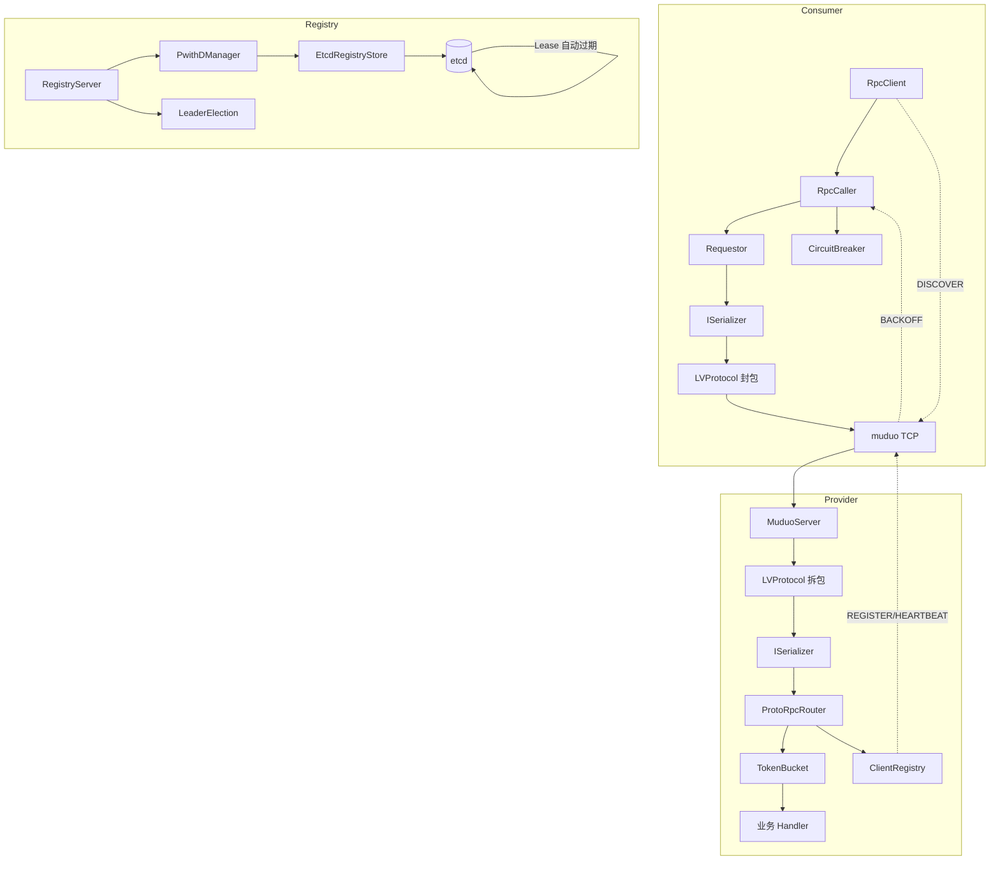

# lyqtRpc

[](https://github.com/lczllx/RPC/actions/workflows/ci.yml)

作者：lczllx  
邮箱：2181719471@qq.com  
GitHub：https://github.com/lczllx/RPC  
开发环境：Ubuntu，VS Code  
编译器：g++  
语言：C++17 
网络：muduo  
传输：TCP / SHM 零拷贝（独立传输层）  
序列化：jsoncpp（JSON）/ Protobuf / FlatBuffers  
构建：CMake  

## 测试环境

| 项目 | 规格 |
|------|------|
| 云服务器 | 4C8G 5Mbps |
| 操作系统 | Ubuntu 22.04.5 LTS |
| 编译器 | g++ 12.3.0 |
| 构建工具 | CMake 3.22.1 |
| 压测方式 | 本机回环 (localhost) |

## 如何复现

子模块必须先拉取：

```bash
git clone https://github.com/lczllx/RPC.git
cd RPC
git submodule update --init --recursive
```

一键构建：

```bash
bash autobuild/quick_build.sh
```

Docker（`docker-compose.yml` 编排 etcd + registry + provider）：

```bash
git submodule update --init --recursive
docker-compose up -d
```

功能演示：

```bash
./demo.sh all              # 全部场景：etcd/offline/timeout/topic/circuit
./demo_discovery.sh        # 注册发现
./demo_benchmark.sh        # JSON/Protobuf 压测
```

## 代码统计

| 项目 | 数值 |
|------|------|
| RPC 框架总行数 | 8,545（仅 `rpc/src/`，不含 muduo 子模块和 proto 生成代码） |
| 自己写的行数 | 8,023（不含空行/注释） |
| 单元测试 | 1,200+ 行，9 个测试文件，54 个测试用例（GTest） |
| 示例代码 | 1,589 行（含 SHM 零拷贝示例 + 压测 1,100+ 行）|
| 源文件数 | 56（`rpc/src/` 下 .h/.hpp/.cc/.cpp，含 SHM 零拷贝模块） |
| 测试覆盖范围 | LV 协议拆包/封包、消息工厂、消息校验、错误码、TokenBucket 限流、ISerializer 编解码、ShmChannel 零拷贝读写/跨进程模拟 |

## 已知缺陷

- **单锁瓶颈**：`Requestor::_request_desc` 用单把 `std::mutex` 保护所有请求映射，高并发下（>5 万 QPS）锁竞争显著。
- **etcd 写放大**：每个 provider 每 3s 对每个 method 各发一次负载上报 PUT（心跳是 10s 一次），method×host 数量一大对 etcd 压力线性增长。
- **无索引优化**：Sweep 采用 etcd 全量前缀扫描 + 内存 diff 对比，provider 数量上万时 O(N) 遍历仍有开销（已从 O(N) 时间戳扫描优化为集合 diff，但仍需全量 GET prefix）。
- **无重试机制**：超时直接失败，调用方需自行实现幂等重试。BACKOFF 退避仅限令牌桶过载场景。
- **静态 `pri_cursor`**：`TopicManager` 的优先级轮转游标是 `static` 变量，被所有 Topic 实例共享，多 topic 场景下轮转语义错乱。
- **Topic 无持久化**：重启丢全部订阅关系和消息。
- **无鉴权/加密**：无 TLS、无认证、无 token 机制。
- **单元测试覆盖不足**：仅覆盖 LV 协议、消息层、令牌桶、序列化器、ShmChannel，注册中心、熔断器、选举、网络层均无单测。
- **SHM 大载荷不如 TCP**：ring buffer 两次 memcpy 是瓶颈，64KB 载荷 P50=1,254μs vs TCP Proto 668μs。
- **SHM 并发扩展受限**：per-connection `ftruncate` 创建开销在短时压测中占比较高，4 线程 QPS 约 2.2× 单线程。

---

这是我用 C++11 + muduo 写的一个轻量 RPC，JSON、Protobuf 都能走，带注册中心、心跳、负载均衡，调用有同步、Future、回调几种。

网络层用 muduo，事件循环、非阻塞 IO、定时器都在这套里，多 IO 线程时用 `EventLoopThreadPool`。RPC 的帧格式、序列化、注册中心不在 muduo 里，在本仓库里实现。

JSON 用 jsoncpp，好调试。Protobuf 走 `call_proto` / `registerProtoHandler`，和压测里的二进制路径一致。**muduo 以 Git 子模块形式在 `rpc/muduo`，克隆后须先拉子模块再 CMake**，CMake 负责 proto 生成与编译 muduo。

TCP 要自己定帧，不然粘包不好拆。LV：`长度 + 类型 + id + body`，收齐一帧再反序列化，`msg_type` 给分发，`id` 对上请求和响应。

**SHM（共享内存）零拷贝传输层**：针对同机微服务通信场景，绕过 TCP 协议栈。per-client 独立 ring buffer + eventfd 通知 + muduo `EventLoopThread` 多线程调度。写端 `Protobuf::SerializeToArray` 直写 ring buffer，读端 `ParseFromString`，消除中间拷贝。支持多客户端并发，单连接延迟 32μs（较同机 TCP 降 63%）。

```bash
# SHM + Protobuf 零拷贝示例（无需 Protobuf/FlatBuffers 之外的额外依赖）
./bin/shm_proto_server &     # 启动服务端（4 worker 线程池）
./bin/shm_proto_client       # 客户端发 3 个 add 请求

# 压测对比
cd example/shm
bash run_shm_benchmark.sh all  # JSON / FlatBuf ZC / Proto ZC 全路径对比
```

---

## 1. 项目简介

RPC 从发请求到收响应整条链路是齐的，benchmark 里对比了 JSON 和 Protobuf。注册中心、心跳、怎么选节点也写了，能跑通、能演示。

---

## 2. 压测（echo 操作，同机对比 brpc）

环境：`4C8G` 云机、`Ubuntu 22.04`、`g++ 12.3.0`、`-O3`，全部使用 Protobuf 序列化。brpc 基于 `multi_threaded_echo` 示例。

### 单线程延迟与吞吐

| 载荷 | brpc TCP | 我们的 TCP Proto | 我们的 SHM Proto ZC | SHM 提升 |
|---|---:|---:|---:|---:|
| 16B QPS | ~14,000 | 10,706 | **25,216** | +136% |
| 16B P50 | ~68μs | 90μs | **28μs** | **-69%** |
| 1KB QPS | ~14,000 | 11,484 | **23,521** | +105% |
| 1KB P50 | ~68μs | 84μs | **30μs** | **-64%** |
| 64KB QPS | ~4,300 | 2,059 | **11,552** | +461% |
| 64KB P50 | ~220μs | 459μs | **68μs** | **-69%** |

> brpc 只输出 avg 延迟，表中为 avg ≈ P50 估算。
> SHM Proto ZC 路径：per-client ring buffer + muduo EventLoop + Protobuf SerializeToArray 直写。

### 4 线程并发（16B echo）

| 指标 | brpc TCP | 我们的 TCP Proto | 我们的 SHM Proto ZC |
|---|---:|---:|---:|
| QPS | ~48,000 | 35,660 | **123,250** |
| P50 | ~82μs | 105μs | **17μs** |

### 我们的传输路径对比（16B echo，单线程）

| 路径 | 序列化 | QPS | P50 | 传输介质 |
|---|---:|---:|---:|---|
| TCP Proto | Protobuf | 10,706 | 90μs | TCP localhost |
| SHM JSON | JSON | 13,809 | 57μs | 共享内存 |
| SHM Proto ZC | Protobuf 零拷贝 | **25,216** | **28μs** | 共享内存 |

> 结论：SHM Proto ZC 单线程延迟 28μs，为 brpc TCP 的 41%；吞吐 25k QPS，为 brpc 的 1.8×。TCP 路径与 brpc 差距约 30%，主要来源于 bthread 协程、IOBuf 零拷贝、baidu_std 多路复用等架构选择的差异。

---

## 3. 快速开始

**子模块（必做）**  
`muduo` 在 `rpc/muduo`，**先拉子模块再 `cmake`**，否则 Configure 会失败：

```bash
git submodule update --init --recursive
```

仅 `git clone` 或 **`git clone --depth 1` 浅克隆** 时，子模块不会自动就绪，务必执行上面命令。默认 `.gitmodules` 为 **HTTPS**（`https://github.com/chenshuo/muduo.git`），部分网络较慢或超时可在本地改为 SSH，例如：

```bash
git config submodule.rpc/muduo.url git@github.com:chenshuo/muduo.git
git submodule sync --recursive
git submodule update --init --recursive
```

**一键构建（推荐）**
```bash
cd RPC
bash autobuild/quick_build.sh
```

**Docker（可选）**  
`docker-compose.yml` 编排 etcd + registry + provider，一键启动完整 RPC 后端。

```bash
# 一键诊断 + 自动部署（推荐，自动处理代理/镜像源）
bash autobuild/docker.sh doctor     # 诊断环境（Docker/权限/网络/Compose）
bash autobuild/docker.sh setup      # 自动配网+构建镜像+启动服务

# 或手动
git submodule update --init --recursive
docker compose up -d                # 构建 + 启动 etcd + registry + provider
```

完整构建（依赖检查、子模块等）：

```bash
cd RPC
bash autobuild/build.sh
```

**依赖（与 CI `.github/workflows/ci.yml` 对齐，Ubuntu 22.04）**  
编译示例与 muduo **至少需要 Boost**（`find_package(Boost)`），与仅装 json/protobuf 不够：

```bash
sudo apt-get update
sudo apt-get install -y --no-install-recommends \
  build-essential \
  cmake \
  pkg-config \
  g++ \
  make \
  libboost-dev \
  libjsoncpp-dev \
  libcurl4-openssl-dev \
  protobuf-compiler \
  libprotobuf-dev
```

若开启单元测试（`-DLCZ_RPC_BUILD_TESTS=ON`），还需 **GTest**（CI 使用系统包，非 CMake 联网拉取）：

```bash
sudo apt-get install -y --no-install-recommends libgtest-dev
```

**编译**
```bash
cd rpc
mkdir -p build && cd build
cmake .. \
  -DCMAKE_BUILD_TYPE=Release \
  -DLCZ_RPC_BUILD_EXAMPLES=ON \
  -DLCZ_RPC_BUILD_TESTS=OFF
make -j
```

跑单测时把 `LCZ_RPC_BUILD_TESTS` 设为 `ON` 并确保已安装 `libgtest-dev`，构建后执行：`./tests/lcz_rpc_unit_tests`。

**示例**
项目内置示例位于 `rpc/example`，常用包括：
- 注册中心：`test/test1/registry_server.cc`
- Provider：`test/test1/rpc_server.cc`
- Consumer：`test/test1/rpc_client.cc`
- Benchmark：`benchmark/benchmark_server.cc`、`benchmark/benchmark_client.cc`
- **共享内存零拷贝**：`shm/`（独立于 TCP 的传输层，per-client ring buffer + muduo EventLoop）
  - JSON 路径：`shm_server.cc` / `shm_client.cc`
  - FlatBuffers 零拷贝：`shm_server_zc.cc` / `shm_client_zc.cc`
  - Protobuf 零拷贝（推荐）：`shm_proto_server.cc` / `shm_proto_client.cc`
  - 压测 6 个 + `run_shm_benchmark.sh`（JSON / FlatBuf ZC / Proto ZC 全路径对比）

> 可执行文件默认输出到 `rpc/build/bin`（含 benchmark 系列）。

**仓库根目录演示脚本（需已编译出 `rpc/build/bin`）**

- `demo.sh {etcd|offline|timeout|topic|circuit|all}`：一键演示 5 个场景
  - `etcd`    — registry 重启，etcd 数据不丢，服务可继续发现
  - `offline` — provider 挂掉，registry 15s 自动剔除
  - `timeout` — 慢 provider 超时控制
  - `topic`   — 发布订阅 5 种转发策略
  - `circuit` — 熔断器：连续失败触发熔断 → 冷却后 HALF_OPEN 探测 → 恢复
- `demo_discovery.sh`：注册发现（test4 registry / provider / consumer）
  - 前置：etcd 需要提前启动（可单独 `docker compose up -d etcd` 或宿主机直接运行 etcd）

**SHM 压测**（在 `example/shm/` 下）：
```bash
cd example/shm
bash run_shm_benchmark.sh all    # JSON / FlatBuf ZC / Proto ZC 全路径对比
bash run_shm_benchmark.sh json   # 仅 JSON
bash run_shm_benchmark.sh proto  # 仅 Protobuf 零拷贝
```

**TCP 压测**

```bash
cd rpc/example/benchmark
./run_benchmark.sh
sh run_benchmark_json.sh
```

---

## 4. 流程图

### 调用链


`RpcClient` / `RpcCaller` 发出请求，服务端按 method 进入 `registerProtoHandler`，响应原路返回。

### 注册与发现


服务方注册并定时心跳。调用方按 method 向注册中心取节点列表，再在本地选择实例。

### 心跳与实例摘除


Provider 绑定 etcd **15s Lease**，心跳走 `LeaseKeepAlive` 续约。Provider 崩溃 → Lease 过期 → etcd 自动删除 key，Registry sweep 改为 etcd 前缀扫描 + 内存集合 diff 感知删除。

### 客户端超时


按 `rid` 注册 muduo 定时器，超时先返回 `TIMEOUT`，响应先到达则取消定时器。迟到响应丢弃，避免与超时重复处理。

---

## 5. 架构

角色：

- **Provider**：对外提供服务，注册、处理 RPC。
- **Consumer**：发 RPC。
- **Registry**：记有哪些实例、心跳、上下线。



调用链：

```text
Consumer
  -> RpcClient / RpcCaller / Requestor
  -> CircuitBreaker（熔断检查）
  -> ISerializer（序列化）
  -> LV 帧封包
  -> muduo 发 TCP
  -> Provider 拆包、反序列化
  -> TokenBucket（流控）
  -> 业务 Handler
  -> 响应往回走
```

注册与发现：

```text
Provider --REGISTER/LeaseKeepAlive--> Registry <--DISCOVER-- Consumer
   │                                         │
   │  Lease 过期 → etcd 自动删 key             │  BACKOFF 退避重试
   └─── Registry sweep diff 感知 ─────────────┘  CircuitBreaker 熔断隔离
```

---

## 6. 功能

**序列化**  
JSON（jsoncpp）好调试。Protobuf 走 `REQ_RPC_PROTO` 等，包一大和 JSON 差距就明显。两条路都留着，想用哪个用哪个。序列化器通过 `ISerializer` 抽象接口插拔，默认 ProtobufSerializer，后续可替换 FlatBuffers 等零拷贝方案。

**LV 协议**  
`LVProtocol` 帧格式：

```text
| 4B total_len | 4B msg_type | 4B id_len | id | body |
```

用 `total_len` 判断一帧是否收齐，再反序列化。`msg_type` 交给 `MessageFactory`，`id` 对应请求与响应。整型字段按网络字节序写。`total_len` 有上限，防止异常大包，具体数值见代码。

**注册、心跳、选节点**  
Provider 注册时绑定 etcd **15s Lease**，心跳走 `LeaseKeepAlive` 续约。Provider 崩溃 → Lease 过期 → etcd 自动删除 key，无需应用层全量扫描。负载均衡：`ROUND_ROBIN`、`RANDOM`、`SOURCE_HASH`、`LOWEST_LOAD`。调用方式：同步、Future、回调。

**注册存储后端**  
通过 `LCZ_ETCD` 环境变量切换。未设置时走内存存储（MemoryRegistryStore），适合单机/测试；设置为 etcd 地址后走 EtcdRegistryStore，注册信息持久化到 etcd，registry 重启不丢数据。

**注册中心多实例 HA**  
设 `LCZ_ETCD` 后启动多个 Registry 实例（同一端口，内核 `SO_REUSEPORT` 分发连接）。实例间通过 etcd lease + CAS 事务选举 leader（5s TTL，1s 续约）；仅 leader 执行过期 provider 扫描，follower 依赖客户端 10s 健康检查兜底。Leader 崩溃后 lease 5s 自动过期，follower 自动接管。

**熔断器**  
三态状态机（CLOSED → OPEN → HALF_OPEN → CLOSED），method×host 粒度，支持环境变量配置阈值（`LCZ_CB_FAILURE_THRESHOLD`、`LCZ_CB_OPEN_DURATION`、`LCZ_CB_HALF_OPEN_MAX`）。存储后端同样走 `LCZ_ETCD` 切换（MemoryCircuitStore / EtcdCircuitStore）。调用方在 `RpcCaller` 层自动检查熔断状态，拒绝请求直接返回 false 不等待网络超时。provider 下线时通过 `delClient()` 回调同步清理连接池和熔断器状态。

**令牌桶流控**  
Provider 端 `TokenBucket` 固定速率生成令牌，超限时返回 `BACKOFF` 错误码并附带 `retry_after_ms`。Client 收到 BACKOFF 后自动等待指定毫秒并重试一次，避免服务端过载雪崩。

**分布式追踪**  
请求携带 `trace_id`（UUID）+ `span_id`，JSON 路径通过 payload 透传，Proto 路径通过 envelope 字段透传。Client/Registry/Provider 三端日志均带 `[trace_id=xxx]`，grep 同一 ID 即可串出完整调用链定位瓶颈。

**日志系统**  
自研异步日志模块：双缓冲 + AsyncLooper 后台线程，支持 DEBUG/INFO/WARN/ERROR/FATAL 五级，输出 `[时间][线程][日志器][文件:行号][级别] 消息`。落地方式可选控制台/文件/滚动文件。

**Topic**  
发布订阅，转发策略有 `BROADCAST`、`ROUND_ROBIN`、`FANOUT`、`SOURCE_HASH`、`PRIORITY`、`REDUNDANT`，和 RPC 共用底层消息和网络。

---

## 7. 实现要点

**粘包**  
靠 `total_len` 判断一帧收没收齐，`canProcessed()` 不过就接着攒，不瞎反序列化，避免越界和脏数据。

**请求和响应对上号**  
每个请求一个 `rid`，客户端 `rid -> ReqDescribe`，回来按 `rid` 分到同步 / future / 回调。在途请求用 `unordered_map` + 一把锁，写得简单，并发高了会抢锁，以后要优化再说。

**超时**  
`runAfter` 挂定时器，响应先到就取消。超时先到就丢后面的包，同一个 `rid` 不会又超时又当成功。

**实例掉线**  
Registry 定时扫过期实例并通知。Consumer 收到就清连接池并同步清理熔断器状态，少往已经下线的节点打。

**熔断隔离**  
每个 provider 的每个方法独立一个 `NodeBreaker` 状态机。连续失败达到阈值自动熔断（OPEN），后续请求直接拒绝不消耗网络资源。冷却期结束后放行一个 HALF_OPEN 探测请求，成功则恢复（CLOSED），失败则继续熔断。状态通过 `ICircuitStateStore` 接口持久化，支持内存和 etcd 两种后端。

---

## 8. 目录

```text
RPC/
├── .github/workflows/       # CI/CD（编译 + 单测 + Docker）
├── autobuild/               # 一键构建脚本
├── docs/                    # 设计文档 + 面试 Q&A
├── flowchat/                # 流程图资源
├── Dockerfile
├── docker-compose.yml
├── demo.sh
├── demo_discovery.sh
├── demo_benchmark.sh
│
└── rpc/
    ├── CMakeLists.txt
    ├── muduo/               # Git 子模块（chenshuo/muduo）
    ├── proto/
    │   └── rpc_envelope.proto  # RPC/Topic/Service 六个 protobuf envelope
    ├── src/
    │   ├── client/
    │   │   ├── shm_client.hpp          # ShmClient（JSON）
    │   │   ├── shm_client_zc.hpp       # ShmClient 零拷贝（FlatBuffers）
    │   │   ├── shm_client_proto.hpp    # ShmClient 零拷贝（Protobuf，SerializeToArray）
    │   │   ├── rpc_client.hpp          # RpcClient + ClientDiscover + 连接池
    │   │   ├── rpc_registry.hpp        # Provider + Discover + MethodHost + 负载均衡
    │   │   ├── caller.hpp              # RpcCaller：同步/Future/回调 + call_proto
    │   │   ├── requestor.hpp           # 请求-响应配对 + 超时 + 回调分发
    │   │   ├── circuit_breaker.hpp     # CircuitBreaker 全局管理
    │   │   ├── circuit_breaker.cpp
    │   │   ├── node_breaker.hpp        # 单 method×host 三态熔断状态机
    │   │   ├── node_breaker.cpp
    │   │   └── rpc_topic.hpp           # TopicClient
    │   ├── server/
    │   │   ├── shm_server.hpp          # ShmServer（JSON，多客户端，worker 线程池 + SO_RCVTIMEO）
    │   │   ├── shm_server_zc.hpp       # ShmServer 零拷贝（FlatBuffers）
    │   │   ├── shm_server_proto.hpp    # ShmServer 零拷贝（Protobuf，muduo EventLoop）
    │   │   ├── rpc_server.hpp          # RpcServer + Provider 注册/心跳/负载上报
    │   │   ├── rpc_registry.hpp        # RegistryServer + PwithDManager + DiscoverManager
    │   │   ├── rpc_router.hpp          # RpcRouter + ProtoRpcRouter + ServiceManager
    │   │   ├── rpc_topic.hpp           # TopicServer + TopicManager
    │   │   ├── registry_store.hpp      # IRegistryStore 抽象接口
    │   │   ├── memory_registry_store.hpp / .cpp  # 内存注册存储
    │   │   ├── etcd_registry_store.hpp / .cpp    # etcd 注册存储（REST API + Lease）
    │   │   ├── leader_election.hpp              # ILeaderElector 抽象接口
    │   │   ├── memory_leader_election.hpp        # 单实例永远 leader
    │   │   ├── etcd_leader_election.hpp / .cpp   # etcd Lease + CAS 选举
    │   │   ├── circuit_store.hpp                 # ICircuitStateStore 抽象接口
    │   │   ├── memory_circuit_store.hpp / .cpp   # 内存熔断存储
    │   │   ├── etcd_circuit_store.hpp / .cpp     # etcd 熔断存储
    │   │   └── async_circuit_store.hpp / .cpp    # 异步批量持久化包装
    │   └── general/
    │       ├── shm_channel.hpp / .cc        # ShmChannel（创建/读写/零拷贝原语/eventfd 握手）
    │       ├── shm_connection.hpp           # ShmConnection（虚拟连接适配 BaseConnection）
    │       ├── shm_zc_adaptor.hpp           # RingBufAllocator + ShmZcReader（FlatBuf 零拷贝读）
    │       ├── net.hpp                # MuduoServer/Client/Connection + LVProtocol + DNS 解析修复
    │       ├── message.hpp            # BaseMessage / JsonMessage / Proto 六个消息类
    │       ├── fields.hpp             # MsgType / RespCode / ServiceOpType 等枚举
    │       ├── abstract.hpp           # BaseServer / BaseProtocol / BaseClient 抽象
    │       ├── dispacher.hpp          # 按 MsgType 路由消息的回调分发器
    │       ├── detail.hpp             # JSON 工具 + uuid()
    │       ├── publicconfig.hpp       # 公共常量
    │       ├── rate_limiter.hpp       # TokenBucket 令牌桶限流器
    │       ├── serializer.hpp         # ISerializer + ProtobufSerializer
    │       └── log_system/            # 异步日志（双缓冲 + AsyncLooper）
    ├── tests/                         # 单元测试（GTest，9 文件 54 用例）
    │   ├── test_shm_channel.cc              # ShmChannel 零拷贝读写 + wrap 跳帧 + 跨进
    │   ├── test_lv_protocol.cc
    │   ├── test_lv_more_messages.cc
    │   ├── test_message_factory.cc
    │   ├── test_message_factory_exhaustive.cc
    │   ├── test_message_checks.cc
    │   ├── test_err_reason.cc
    │   ├── test_rate_limiter.cc
    │   └── test_serializer.cc
    └── example/                       # 示例 + 压测 + 单测辅助
        ├── shm/                             # SHM 零拷贝示例 + 压测（12 个文件 + run_shm_benchmark.sh）
        ├── benchmark/                 # benchmark_server/client（Proto + JSON）
        └── test/
            ├── despacher_*_test.cc    # 分发器功能测试
            ├── message_test.cc        # 消息编解码测试
            └── test1~4/               # 注册发现/熔断/Topic/Docker 场景
```

---

## 9. 规划实现

- [x] 单测与回归（GitHub Actions 运行 `lcz_rpc_unit_tests`）
- [x] 部署入门：Dockerfile + CI 校验 `docker build`
- [x] etcd 注册存储：EtcdRegistryStore + MemoryRegistryStore，环境变量切换
- [x] 熔断：三态状态机，method×host 粒度，支持内存/etcd 持久化，环境变量可配
- [x] 注册中心多实例 HA：etcd lease + CAS 选举 leader，SO_REUSEPORT 多实例同端口部署
- [x] Provider 心跳从 timestamp 扫描改为 etcd Lease 机制（15s TTL，LeaseKeepAlive 续约）
- [x] 令牌桶限流：Provider 端 `TokenBucket` + `BACKOFF` 退避重试
- [x] 分布式追踪：`trace_id` / `span_id` 全链路透传，三端日志串联
- [x] 序列化器抽象：`ISerializer` 接口 + `ProtobufSerializer` 默认实现，支持插拔替换
- [ ] 监控：QPS、延迟分位、错误码
