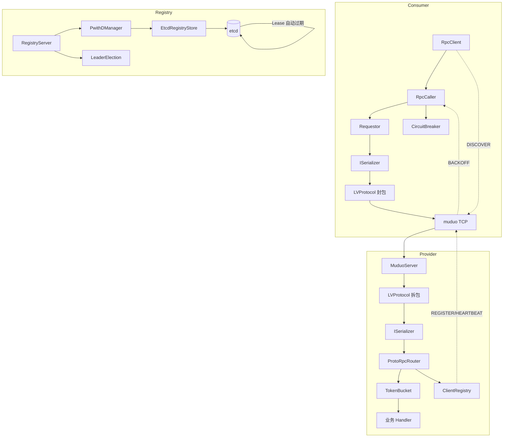
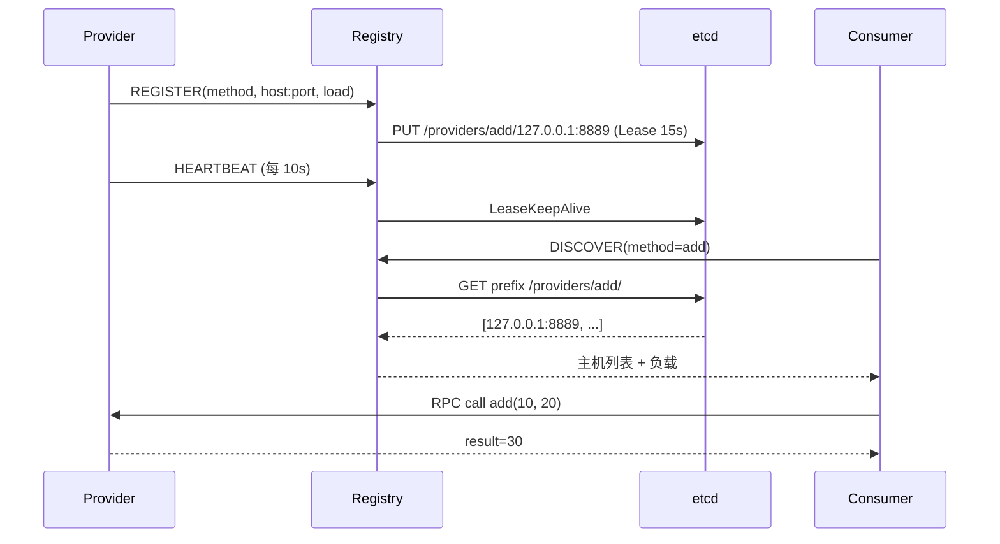
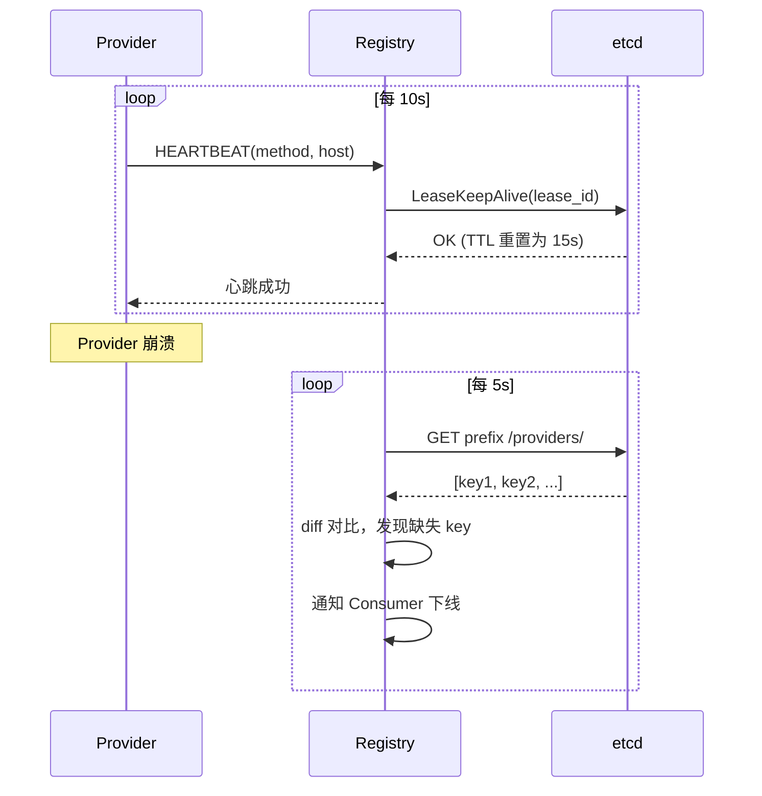
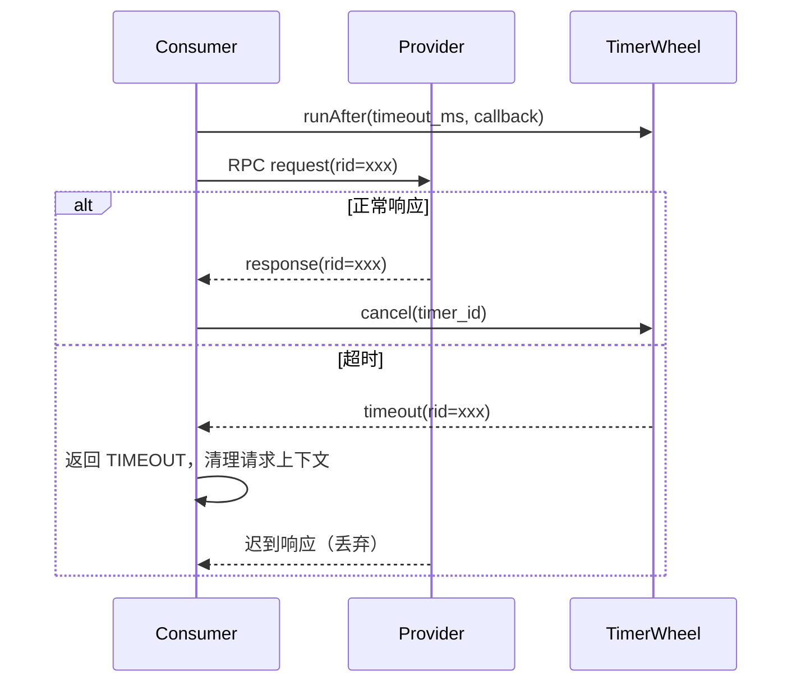

# lyqtRpc 架构设计

## 角色与调用链

- **Provider**：对外提供 RPC 服务，启动时向 Registry 注册方法，定时心跳续约、上报负载
- **Consumer**：发起 RPC 调用，通过 Registry 发现 Provider 节点列表，本地负载均衡后发起请求
- **Registry**：管理 Provider 的注册、心跳、上下线通知，基于 etcd 持久化 + Lease 自动过期



调用链：

```text
Consumer
  -> RpcClient / RpcCaller / Requestor
  -> CircuitBreaker（熔断检查）
  -> ISerializer（序列化）
  -> LV 帧封包
  -> muduo 发 TCP
  -> Provider 拆包、反序列化
  -> TokenBucket（流控）
  -> 业务 Handler
  -> 响应往回走
```


---

## 注册与发现




Provider 注册时绑定 etcd **15s Lease**，心跳走 `LeaseKeepAlive` 续约。Provider 崩溃 → Lease 过期 → etcd 自动删除 key，Registry sweep 通过 etcd 前缀扫描 + 内存集合 diff 感知删除。


---

## 心跳与实例摘除



---

## 客户端超时控制



按 `rid` 注册 muduo 定时器，超时先返回 `TIMEOUT`，响应先到达则取消定时器。同一个 `rid` 不会同时超时和成功。


---

## LV 协议帧格式

```text
| 4B total_len | 4B msg_type | 4B id_len | id (变长) | body (变长) |
```

- `total_len`：除自身 4B 外的完整帧长度，网络字节序
- `msg_type`：`MsgType` 枚举值（REQ_RPC=0, RSP_RPC=1, ...），`MessageFactory::create()` 据此构造消息对象
- `id_len` + `id`：请求 ID（`_rid`），用于请求-响应对号
- `body`：序列化后的消息体（JSON 或 Protobuf 二进制）

收帧逻辑：`canProcessed()` 先读 4B 总长度 + 4B 消息类型，判断是否收齐完整帧再反序列化，不完整则继续攒数据，避免越界和脏数据反序列化。

---

## SHM 零拷贝传输层

### TCP Loopback 路径

```
Client 进程                           Server 进程
┌──────────────┐                    ┌──────────────┐
│ serialize()  │  ① std::string     │ unserialize() │
│   ↓          │                    │   ↑          │
│ muduo Buffer │  ② memcpy          │ muduo Buffer │ ③ retrieveAsString
│   ↓          │                    │   ↑          │
│ Socket send  │  ③ copy_from_user  │ Socket recv  │ ④ copy_to_user
│   ↓          │    → sk_buff       │   ↑          │
│   TCP/IP     │  ④ 协议栈封装       │   TCP/IP     │ ⑤ 协议栈解包
│   ↓          │                    │   ↑          │
│   lo 接口    │════ 内核拷贝 ═══════│   lo 接口    │
└──────────────┘                    └──────────────┘
```

数据拷贝 5 次（序列化分配 → Buffer 整理 → 内核态拷贝×2 → Buffer→string）。

### SHM 零拷贝路径

```
Client 进程                           Server 进程
┌─────────────────────┐             ┌─────────────────────┐
│ SerializeToArray()  │ ① 直写      │ ParseFromArray()    │ ③ 就地解析
│   ↓                 │             │   ↑                 │
│ req_write_ptr() ────┼──→ ring buffer ←── read_request() │
│   (返回 body 地址)   │  mmap 共享   │   (返回 body 引用)  │
│   ↓                 │             │   ↑                 │
│ req_commit() ───┼──→ write_idx.store(release)          │
│ notify_req()        │  eventfd    │ epoll_wait()        │ ② 内核通知
└─────────────────────┘             └─────────────────────┘
```

数据拷贝 1 次（序列化直接写入 ring buffer），系统调用 0 次（仅 eventfd 通知）。

### Ring Buffer 无锁 SPSC 实现

使用 `std::atomic` 的 release/acquire 语义保证线程安全，无需 CAS：

```cpp
// 生产者写入
ch.write_idx.store(w + frame_len, std::memory_order_release);

// 消费者读取（配对的 acquire）
uint64_t w = ch.write_idx.load(std::memory_order_acquire);
```

`write_idx` 和 `read_idx` 分别只有一个线程写入（SPSC），uint64 回绕自动正确。

---

## 功能模块

### 序列化

`ISerializer` 抽象接口支持插拔。默认 `ProtobufSerializer` 调用 `msg->serialize()`/`msg->unserialize()`。JSON 路径用于调试，FlatBuffers 路径实现读端零拷贝。

### 注册中心 HA

多个 Registry 实例共享 etcd 后端，同端口通过 `SO_REUSEPORT` 分发。Lease + CAS 事务选举 leader（5s TTL，1s 续约），仅 leader 执行过期扫描，follower 依赖客户端 10s 健康检查。

### 熔断器

三态状态机（CLOSED → OPEN → HALF_OPEN → CLOSED），method×host 粒度。状态通过 `ICircuitStateStore` 接口持久化，支持内存和 etcd 两种后端。

### 令牌桶流控

Provider 端 `TokenBucket` 固定速率生成令牌。超限返回 `BACKOFF` + `retry_after_ms`，Client 收到后自动等待重试。

### 分布式追踪

`trace_id`（UUID）+ `span_id` 通过 JSON payload 或 Proto envelope 字段透传。三端日志 grep 同一 trace_id 串出调用链。

### 日志系统

双缓冲异步日志，AsyncLooper 后台线程，五级（DEBUG~FATAL），支持控制台/文件/滚动文件。

### Topic 发布订阅

支持 `BROADCAST` / `ROUND_ROBIN` / `FANOUT` / `SOURCE_HASH` / `PRIORITY` / `REDUNDANT` 六种转发策略，与 RPC 共用底层消息和网络。

### 可观测性（Prometheus /metrics）

内建 Prometheus 文本协议（0.0.4）端点，对标 brpc `/vars` 核心项。设计为"业务线程内联埋点 + 独立线程按需导出"：

- **埋点**：Counter/Gauge/Histogram 全部基于 `std::atomic`（relaxed），业务线程处理请求时就地 `+1`，无采集线程、无队列；Registry 单例懒注册，首次使用自动创建序列
- **导出**：`MetricsServer` 单线程（muduo EventLoop + Channel）监听 `:9090`，scrape 时读取原子快照拼文本返回；`process_*` 进程级指标（CPU/RSS/fd/线程数/负载）在 scrape 时现读 `/proc`，无人拉取零开销
- **指标覆盖**：服务端 `rpc_requests_total`/`rpc_request_duration_us`（直方图）/`rpc_concurrency`/`rpc_errors_total`/`rpc_connection_count`，客户端 `rpc_client_*`（RTT/并发/错误），治理组件 `circuit_breaker_state`/`token_bucket_available`/`rpc_rate_limited_total`/`registry_heartbeats_total`
- **分位数策略**：进程内只存直方图原始桶，P99 由查询侧 `histogram_quantile()` 计算（与官方 client 库一致；brpc 为进程内滑动窗口计算，是两种取舍）
- **约定细节**：错误计数启动即预注册为 0（区分"零错误"与"序列不存在"）；`_total` 后缀的单调 Gauge 导出 TYPE 修正为 counter；导出 15 位精度避免大数退化为科学计数法
