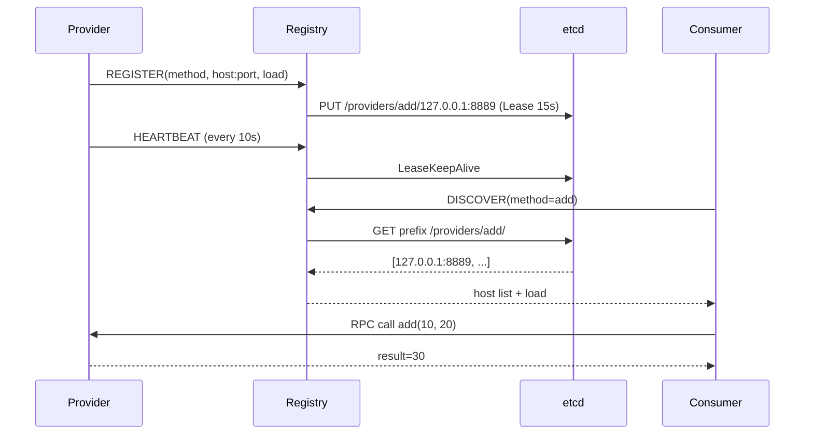
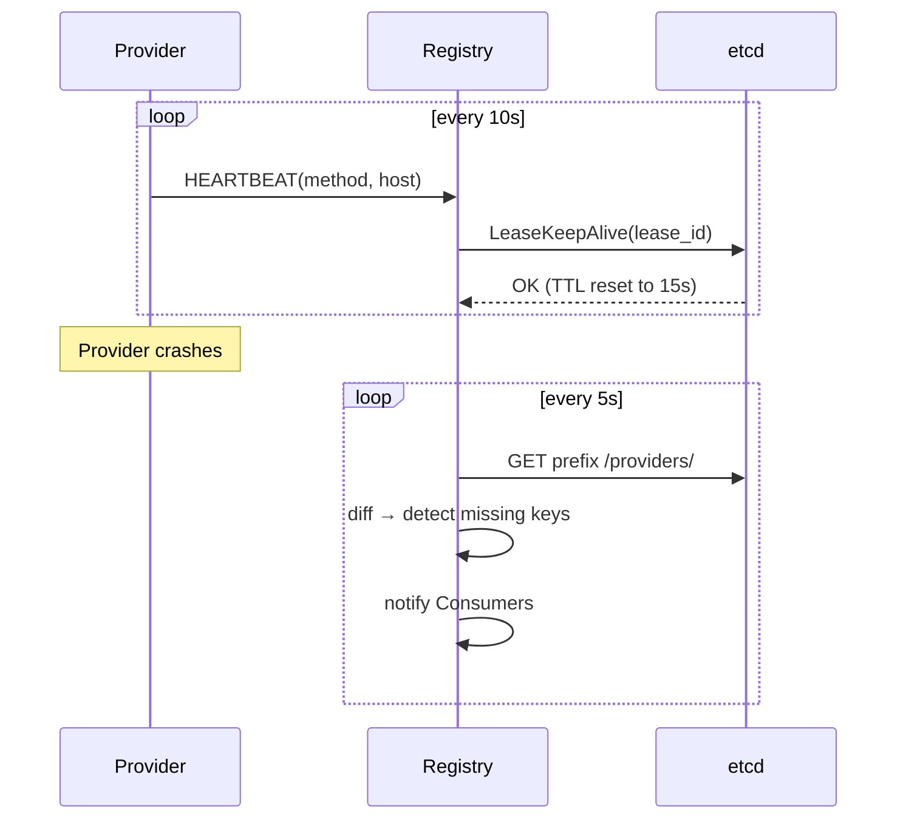
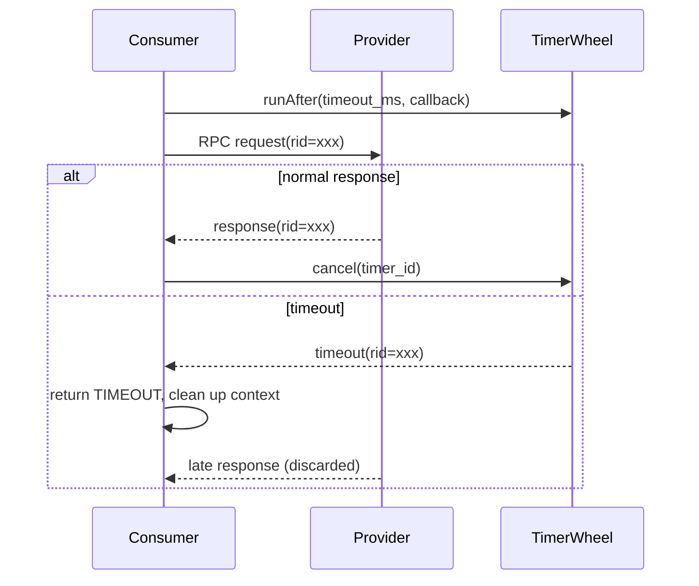

# lyqtRpc Architecture

## Components

- **Provider**: Exposes RPC services, registers with Registry on startup, sends periodic heartbeats and load reports
- **Consumer**: Discovers Provider nodes via Registry, applies client-side load balancing, sends RPC calls
- **Registry**: Manages Provider lifecycle (register, heartbeat, deregister), backed by etcd with Lease-based auto-expiry

## RPC Call Chain


```
Consumer
  -> RpcClient / RpcCaller / Requestor
  -> CircuitBreaker（circuit check）
  -> ISerializer（serialize）
  -> LVProtocol framing
  -> muduo TCP send
  -> Provider unframe, deserialize
  -> TokenBucket（rate limiting）
  -> business handler
  -> response back
```

## Service Registry & Discovery




The Provider binds an etcd **15s Lease** on registration, refreshed via `LeaseKeepAlive`. If the Provider crashes, the Lease expires and etcd auto-deletes the key. Registry sweep detects deletions via prefix scan + in-memory set diff.

## Heartbeat & Instance Eviction




## Client-Side Timeout




A muduo timer is registered per `rid`. Timeout returns `TIMEOUT` first; a successful response cancels the timer. Late responses for the same `rid` are discarded to prevent double-processing.

---

## LV Protocol Frame Format

```text
| 4B total_len | 4B msg_type | 4B id_len | id (variable) | body (variable) |
```

- `total_len`: full frame length excluding these 4 bytes, network byte order
- `msg_type`: `MsgType` enum (e.g., REQ_RPC=0, RSP_RPC=1), used by `MessageFactory::create()`
- `id_len` + `id`: request ID (`_rid`) for matching requests to responses
- `body`: serialized body (JSON or Protobuf binary)

`canProcessed()` checks whether a complete frame has arrived before deserializing.

---

## SHM Zero-Copy Transport

### TCP Loopback Path

```
Client Process                         Server Process
┌──────────────┐                    ┌──────────────┐
│ serialize()  │  ① std::string     │ unserialize() │
│   ↓          │                    │   ↑          │
│ muduo Buffer │  ② memcpy          │ muduo Buffer │ ③ retrieveAsString
│   ↓          │                    │   ↑          │
│ Socket send  │  ③ copy_from_user  │ Socket recv  │ ④ copy_to_user
│   ↓          │    → sk_buff       │   ↑          │
│   TCP/IP     │  ④ stack overhead   │   TCP/IP     │ ⑤ stack overhead
│   ↓          │                    │   ↑          │
│   lo iface   │════ kernel copy ════│   lo iface   │
└──────────────┘                    └──────────────┘
```

5 data copies (serialize alloc → Buffer trim → kernel copy×2 → Buffer→string).

### SHM Zero-Copy Path

```
Client Process                         Server Process
┌─────────────────────┐             ┌─────────────────────┐
│ SerializeToArray()  │ ① direct    │ ParseFromArray()    │ ③ in-place parse
│   ↓                 │             │   ↑                 │
│ req_write_ptr() ────┼──→ ring buffer ←── read_request() │
│   (returns body ptr) │  mmap shared │   (returns body ref) │
│   ↓                 │             │   ↑                 │
│ req_commit() ───┼──→ write_idx.store(release)          │
│ notify_req()        │  eventfd    │ epoll_wait()        │ ② kernel notify
└─────────────────────┘             └─────────────────────┘
```

1 data copy (serialize directly into ring buffer), 0 data syscalls (eventfd notification only).

### Lock-Free SPSC Ring Buffer

Thread safety via `std::atomic` release/acquire semantics, no CAS needed:

```cpp
// Producer publishes
ch.write_idx.store(w + frame_len, std::memory_order_release);

// Consumer sees (paired acquire)
uint64_t w = ch.write_idx.load(std::memory_order_acquire);
```

`write_idx` and `read_idx` are each written by a single thread (SPSC). uint64 wraparound is automatically correct.

---

## Feature Modules

### Serialization

The `ISerializer` interface supports pluggable backends. Default `ProtobufSerializer` delegates to `msg->serialize()`/`msg->unserialize()`. JSON is used for debugging. FlatBuffers provides true zero-copy reads via `GetRoot<T>()`.

### Registry HA

Multiple Registry instances share an etcd backend. `SO_REUSEPORT` distributes connections on the same port. etcd lease + CAS transaction elects a leader (5s TTL, 1s renewal). Only the leader runs expiration sweep; followers rely on client-side 10s health checks.

### Circuit Breaker

Three-state state machine (CLOSED → OPEN → HALF_OPEN → CLOSED), per method×host granularity. State persists via the `ICircuitStateStore` interface with in-memory and etcd backends.

### Token Bucket Rate Limiting

Provider-side `TokenBucket` generates tokens at a fixed rate. Excess requests return `BACKOFF` with `retry_after_ms`. The Client auto-waits before retrying.

### Distributed Tracing

`trace_id` (UUID) + `span_id` propagated via JSON payload or Proto envelope fields. grep the same trace_id across Client/Registry/Provider logs to reconstruct full call chains.

### Async Logging

Double-buffered async logger with background `AsyncLooper` thread. Five levels (DEBUG~FATAL). Supports console, file, and rolling file sinks.

### Pub/Sub Topics

Six forwarding strategies: `BROADCAST`, `ROUND_ROBIN`, `FANOUT`, `SOURCE_HASH`, `PRIORITY`, `REDUNDANT`. Shares the underlying messaging and network layer with RPC.
