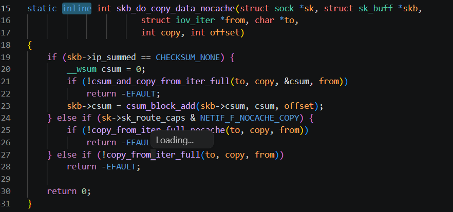
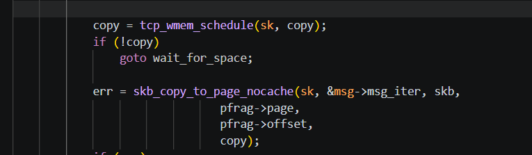
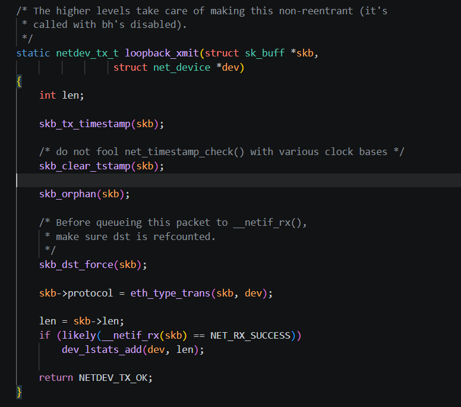
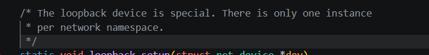
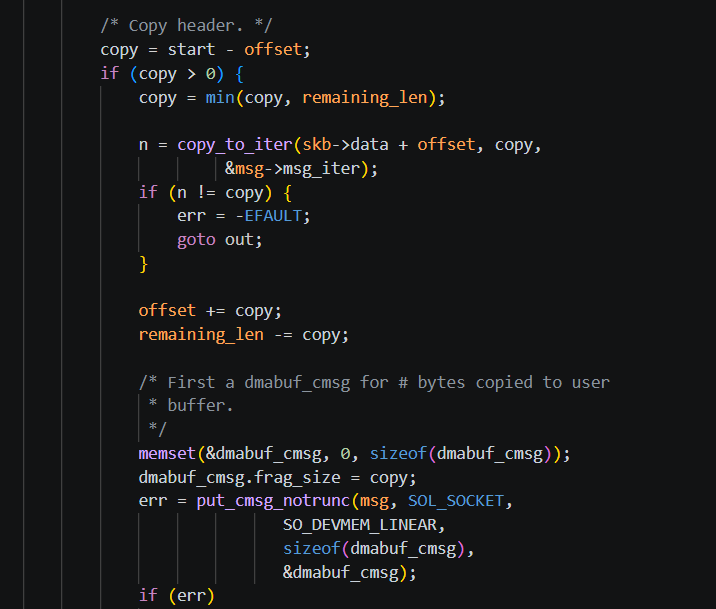
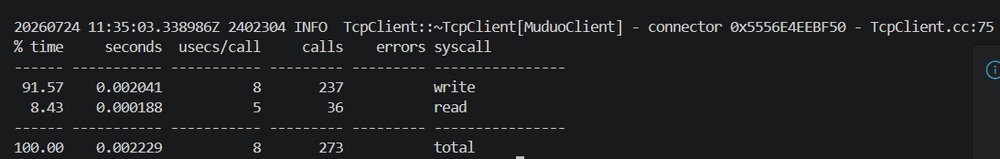
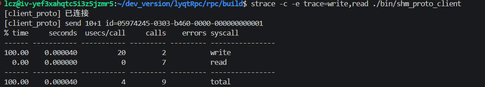

# From TCP 90μs to SHM 28μs: Zero-Copy Optimization in My RPC Framework

> Same echo request — 90μs over TCP loopback, 28μs over shared memory. Here's what I learned building it and where the difference actually comes from.

---

## Why TCP Is Slow — Even on Localhost

Start with a simple analogy.

You need to grab equipment from the storage room. SHM is walking over and picking it up yourself — one trip. TCP is calling a friend to get it, who might call their friend — each handoff adds overhead.

At the code level, localhost TCP still punches through the entire kernel network stack even though no physical wire is involved:

1. `send()` copies data from userspace into the kernel
2. The kernel allocates an `sk_buff` and may clone it
3. The loopback device re-injects the packet from the TX queue into the RX queue
4. `recv()` copies data from the kernel back to userspace

Every one of these is a real CPU copy. The loopback device's own comment says it — "The loopback device is special. There is no DMA." No DMA means the CPU does all the heavy lifting. It looks like it goes through a NIC, but it's just looping inside the kernel.

Here are those four copy points in the kernel source:

| Copy | File | Function | What It Does |
|---|---|---|---|
| ① | `include/net/sock.h:2315` | `skb_do_copy_data_nocache` → `copy_from_iter_full` | User buffer → kernel skb |
| ② | `net/ipv4/tcp.c:1310` | `skb_copy_to_page_nocache` | Protocol stack may re-allocate and copy |
| ③ | `drivers/net/loopback.c:70` | `loopback_xmit` → `__netif_rx` | Loopback re-injection, no DMA |
| ④ | `net/ipv4/tcp.c:2525` | `copy_to_iter` | Kernel skb → user buffer |







`strace` makes it obvious — 100 echo requests over TCP trigger 237 `write` syscalls alone:


```
$ strace -c -e trace=write,read ./benchmark_client single echo 100 1 1

write  237 calls   read  36 calls   → 273 syscalls / 100 requests
                                      ~2.7 syscalls per request
```

Each send/recv means at least one kernel copy. Per request: 3–4 CPU copies (send copy-in + loopback re-injection + recv copy-out; skb cloning is conditional). 100 requests means the data gets shuffled around 300–400 times.

---

## What SHM Does — Cut Out the Middlemen

Shared memory is one sentence: Client and Server map the same physical memory. Write data in, the other side reads it directly. No kernel involvement, no send/recv, no protocol stack.

In my project, the data path is: Client serializes Proto → one `memcpy` into the ring buffer → `eventfd` notify → Server's epoll wakes up → `body.assign` reads straight from mmap.

```
Client User Buffer
  │  ① memcpy → ring buffer (userspace, the only copy)
  ▼
ring buffer (mmap, same physical page as Server → no copy_to_user needed)
  │  ② body.assign (userspace, reads directly from mmap)
  ▼
Server User Buffer
```

In `shm_channel.cc`, the write side is three `memcpy` calls — frame_len, msg_type, body — then `store(write_idx, release)` to publish. The read side: one line, `body.assign(data_base + offset + 8, frame_len - 8)`, straight from mmap into a string.

.png)
.png)

Same 100 requests over SHM:


```
$ strace -c -e trace=write,read ./shm_proto_client

write   2 calls    read   7 calls    → 9 syscalls
                                      0 data-path syscalls
```

TCP 273 → SHM 9. Those 9 are eventfd notifications — nothing to do with moving data. TCP is like asking someone in the kernel to move things for you: call them (syscall), they move it (kernel copy), they tell you it's done (return to userspace). SHM is walking over and moving it yourself — one trip.

### How a Frame Sits in the Ring Buffer

Each frame is an 8-byte header + Protobuf body:

```
┌──────────┬──────────┬────────────────┐
│frame_len │ msg_type │     body       │
│  4B      │  4B      │   variable     │
└──────────┴──────────┴────────────────┘
```

`frame_len = 8 + body_len`, not counting its own 4 bytes. The reader checks frame_len first; if there isn't enough data, it waits for the next epoll wakeup. When a full frame is available, it reads it, advances `read_idx`, and that space is freed.

Edge case: what if the remaining bytes at the tail of the ring buffer aren't enough for a full frame? The Producer writes a skip frame (`frame_len = 0`), adds the tail length to `write_idx` so it naturally wraps to the buffer head. The Consumer sees `frame_len = 0`, adds the same tail length to `read_idx`, and continues reading from the head. Neither side "resets to zero" — both indices keep incrementing, and the modulo wraps them around automatically.

Both `write_idx` and `read_idx` are `uint64_t`. Will they overflow? `uint64_t` subtraction is modulo 2^64 — even after wrapping, `w - r` still gives the correct used byte count. SPSC ring buffers don't need explicit wrap handling.

### How eventfd Notifies the Other Side

You don't poll `write_idx` in a busy loop — that pegs a CPU core for nothing. Use `eventfd`, a lightweight event object provided by the Linux kernel.

```
Producer: memcpy to ring buffer → write(eventfd, 8B)  ← one syscall
Consumer: epoll wakes up → read(eventfd, 8B) → read ring buffer
```

`EFD_SEMAPHORE` mode: each `write` increments an internal counter by 1; each `read` returns 1 and decrements by 1. Five consecutive requests (5 writes), the Server's epoll fires once but needs 5 reads to clear the counter — no notifications are lost.

One more problem: how do you pass an `eventfd` between processes? It's anonymous — no filename, so the other process can't `open` it. The answer is `SCM_RIGHTS` — out-of-band data over a Unix domain socket. The kernel copies the sender's fd entry directly into the receiver's fd table. The two processes see different fd numbers (server fd=5, client fd=7), but both point to the same kernel `struct file` object.

### Memory Ordering: Write Data First, Publish After

The ring buffer has no lock. Correctness relies on `std::atomic` release/acquire semantics.

```
Producer: ① memcpy data    ② store(write_idx, release)  ← never reorder
Consumer: ③ load(write_idx, acquire)  ④ memcpy read data
```

`release` guarantees step ① finishes before step ② becomes visible. The consumer, after `acquire`, is guaranteed to see the complete data. If the CPU reorders these — publish `write_idx` before finishing the `memcpy` — the Consumer reads half-garbage: an old frame header mixed with new body bytes, crashes on parse. On x86, `release-store` compiles to a plain `mov` (TSO guarantees order in hardware), but the compiler must not move the `memcpy` past the store — that's exactly what `std::memory_order_release` constrains: it's for the compiler, not just the CPU.

---

## Things I Learned While Building It

### Two Ring Buffers, Not One Shared Buffer

I started with a single shared memory region for both directions — Client writes req and Server writes resp on the same buffer. Problem: both sides compete for the same `write_idx`. You'd need a lock. Lock contention starts around 20ns; under higher concurrency, `pthread_mutex` goes straight to `futex` inside the kernel. All that effort to bypass TCP's overhead, and a single lock drags it back. So each Client gets its own pair of ring buffers (req 1MB + resp 1MB). One Producer per direction. No lock needed.

This is the classic "trade memory for locks" decision — 100 Clients means 200MB of shared memory. Totally fine for same-machine microservices.

### Placement New Is Not Optional

`ShmControl` contains two `std::atomic<uint64_t>` members (write_idx / read_idx). For atomics, the constructor does more than write initial values — it also initializes internal state like the lock-free flag (used by `is_lock_free()`) and other implementation details.

The first time I built this, I constructed a `ShmControl` on the stack and `memcpy(&stack_obj, mmap_addr, sizeof)`'d it over. It linked. Tests passed. Then it hung intermittently. Took me half a day to realize: `memcpy` only moves the bit pattern. The atomic's internal metadata was still sitting in the stack object that had already been destructed. The atomic on the mmap'd memory was in an "unconstructed" state — subsequent `store`/`load` had undefined behavior. Not crashing was luck; crashing or silently dropping updates was normal. `placement new` calls the constructor directly on the mmap'd address, and all atomic state lives in shared memory where both processes can see it.

### Why FlatBufferBuilder Can't Be Constructed In-Place on a Ring Buffer

FlatBufferBuilder needs a contiguous buffer. But a ring buffer's "available space" is two disjoint segments — a tail piece and a head piece. FBB doesn't know or care that you're using a ring; it sees `buffer + size` and assumes it's contiguous. When the remaining contiguous space is less than `initial_size + 16`, FBB throws `std::bad_alloc`.

I tried writing a custom Allocator to let FBB wrap around the tail → head boundary, but FBB uses relative offset pointers internally — once you cross a segment boundary, all the pointer math breaks. Conclusion: not worth it. Build on the heap, one `memcpy` into the ring buffer. On the read side, FlatBuffers' `GetRoot<T>()` reads fields directly from the mmap'd memory — that side is truly zero-copy, which is what FlatBuffers is designed for.

### `_rid` Was Never Serialized — TCP Hid the Bug

`BaseMessage::_rid` is the unique ID generated for each RPC call. The Client uses it to match a response to its original request. But this field was never written into either the JSON or Proto envelope. On TCP's single-connection in-order delivery, the first response always arrives before the second — implicit ordering masked the missing ID, and matching never failed.

After switching to SHM, the ring buffer is lock-free and circular — if the Client sends 3 requests in quick succession, the Server's responses may not be written back in exactly the same order. The Client receives a response, compares `resp->rid()` with `expected_rid` — never matches, request hangs forever. Took half a day to trace it back to the serialization layer. Fixed by adding the `id` field to both `JsonMessage::serialize()` and `rpc_envelope.proto` — applied to TCP and SHM paths.

---

## Performance and What the Numbers Mean

```
Single-threaded echo 16B：

         QPS       P50
TCP      10,706    90μs
SHM      25,216    28μs

Gain     2.4×     ↓69%
```

Note: in synchronous RPC mode, the Client sends one request and blocks until the response arrives. The next request only goes out after this round-trip completes — at most one small packet is ever in flight. Nagle's algorithm has nothing to accumulate, so it never triggers a delayed send. Whether `TCP_NODELAY` is set or not makes essentially no difference to the P50 numbers — not because Nagle is disabled, but because the synchronous call pattern naturally sidesteps it.

For small payloads (≤4KB), the bottleneck isn't memcpy bandwidth — copying 16 bytes is instant. The real cost is syscalls (~20μs) + protocol stack logic (congestion control / Nagle ~30μs) + kernel scheduling. SHM squeezes syscalls from 2 per request down to 1 (only `eventfd` notification) and eliminates the protocol stack entirely — that ~50μs gap is exactly where the 28μs vs 90μs difference comes from.

For cross-machine zero-copy, there's RDMA (InfiniBand / RoCE NICs, single-digit microseconds). But same-machine doesn't need special hardware — `/dev/shm` is the closest thing to "RDMA" you'll find on any Linux box.

---

## Wrapping Up

Before building this TCP → SHM migration, my mental model of IPC was "socket, send, recv." After building it, I realized — even localhost TCP punches through the entire kernel network stack. Every copy and syscall along the way adds up. SHM is fundamentally about removing those middlemen: two processes working directly on the same memory.

Three tiers of IPC, by physical distance:

```
Same machine, process to process → SHM (zero extra hardware, 28μs)
Same datacenter, machine to machine → RDMA (needs InfiniBand / RoCE NIC, ~5μs)
Cross-region / WAN → TCP (most universal, 90μs+)
```

Project: [github.com/lczllx/lyqtRpc](https://github.com/lczllx/lyqtRpc).
